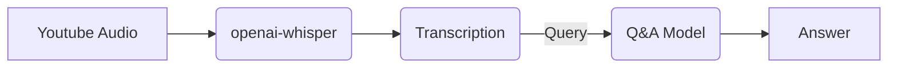

youtube-qa
==============================

Transcribing youtube video and asking Questions from the transcription.

[Try it out!](https://huggingface.co/spaces/bhavyagiri/Youtube-QA)

https://github.com/bhavya-giri/youtube-qa/assets/102273412/203794a9-8e3d-4ee5-99df-59395bc2dafb


### Flow



Project Organization
------------
    ├── README.md          <- The top-level README for developers using this project.
    |
    ├── app
    │   ├── app.py               <- Gradio App
    │   ├── requirements.txt     <- Requirements for Gradio App
    │
    ├── notebooks          
    |   ├── Transcribe.ipynb                   <- Process of Transcription with openai-whisper
    │   ├── question-answering.ipynb           <- Using Q&A Model on generated text
    │
    └──  requirements.txt   <- The requirements file for reproducing the analysis environment, e.g.

 ## Run Locally

Clone the project

```bash
  git clone https://github.com/bhavya-giri/youtube-qa
```

Go to the project directory

```bash
  cd youtube-qa
```

Install dependencies

```bash
  pip install requirements.txt
```

Start the notebook

```bash
  jupyter notebook
```
or open with Juoyter Lab

```bash
 jupyter lab
```
